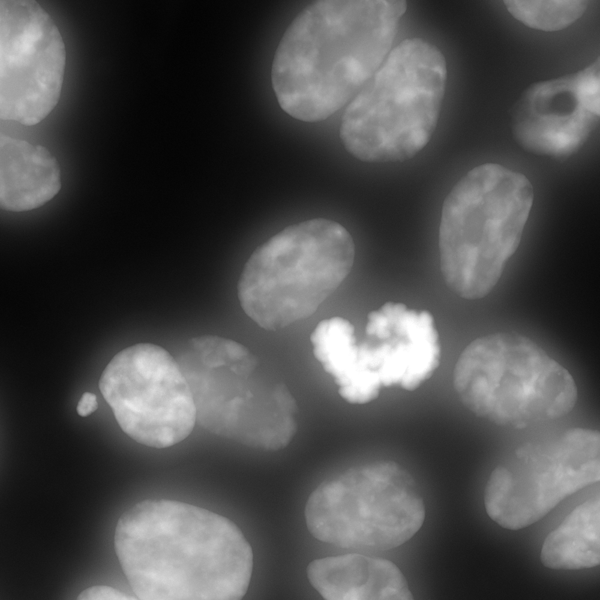
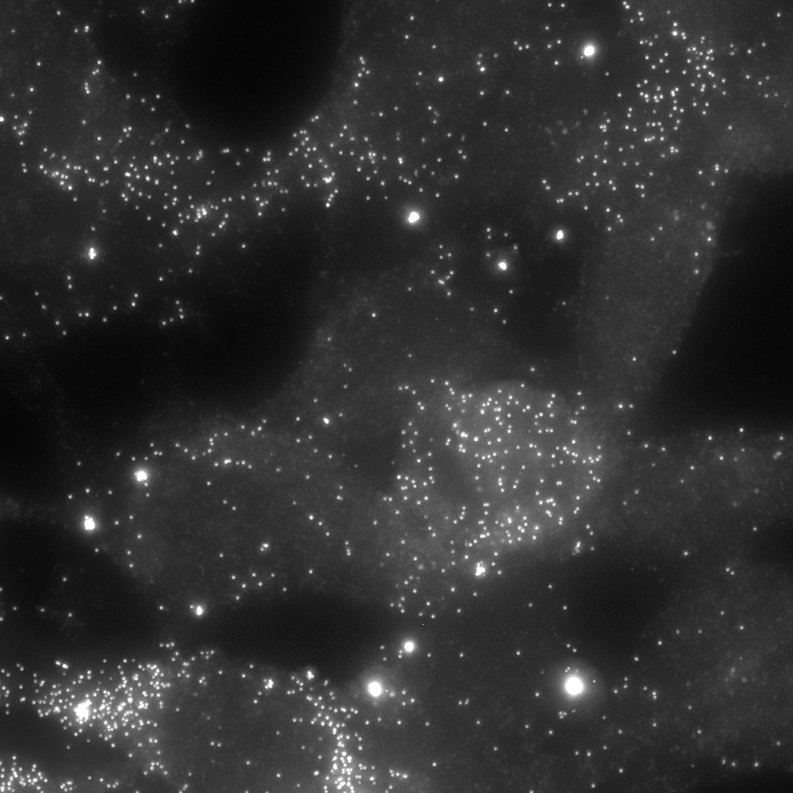
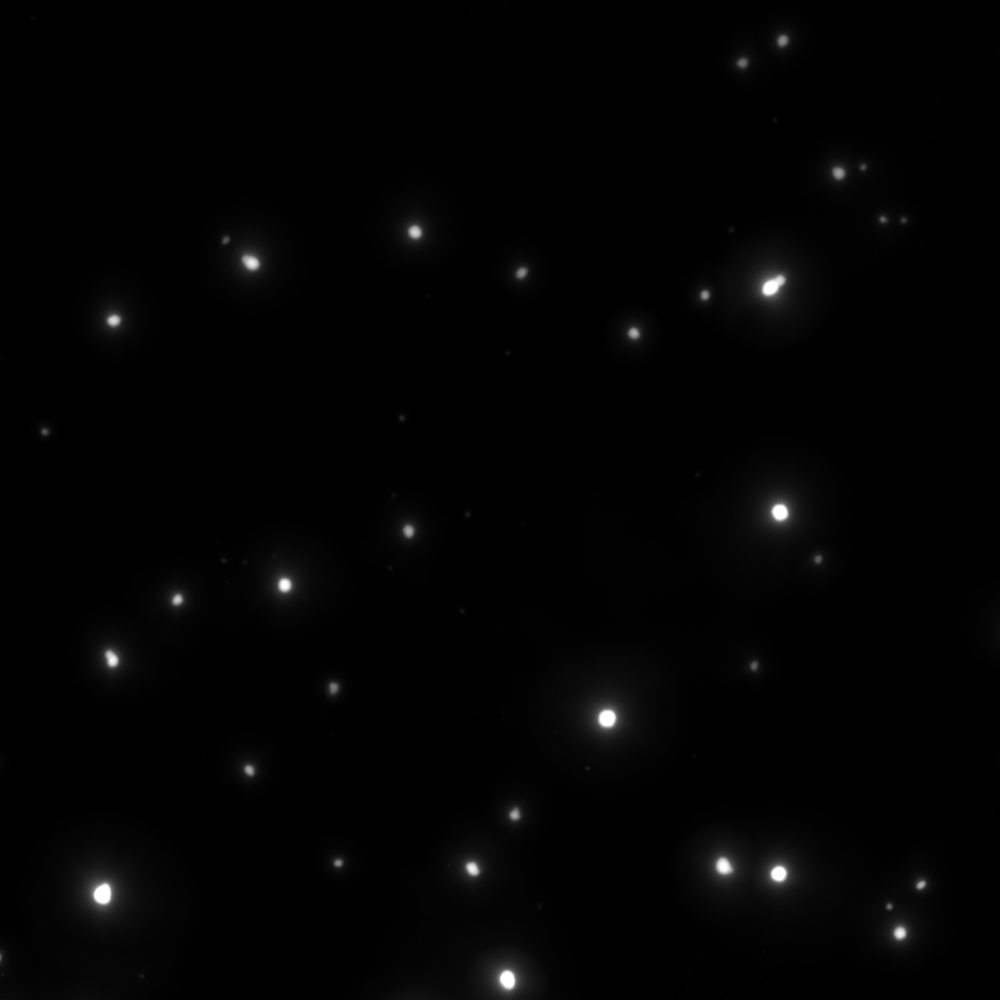
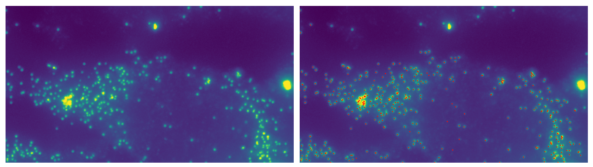
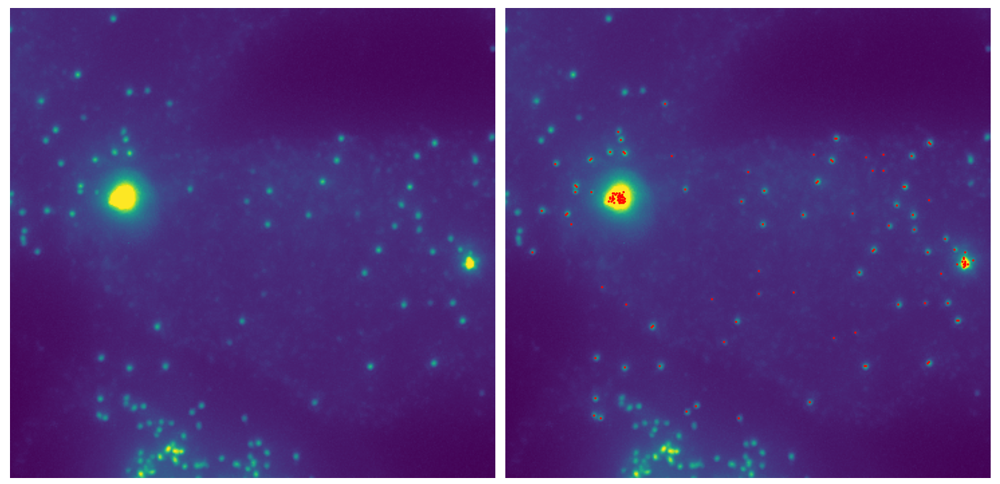
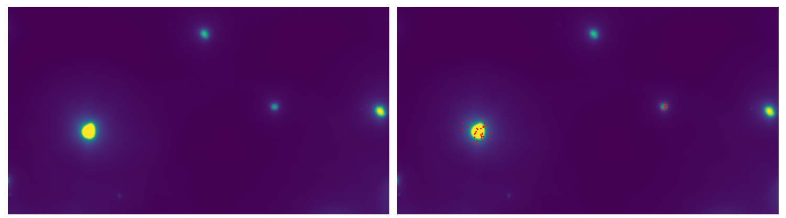
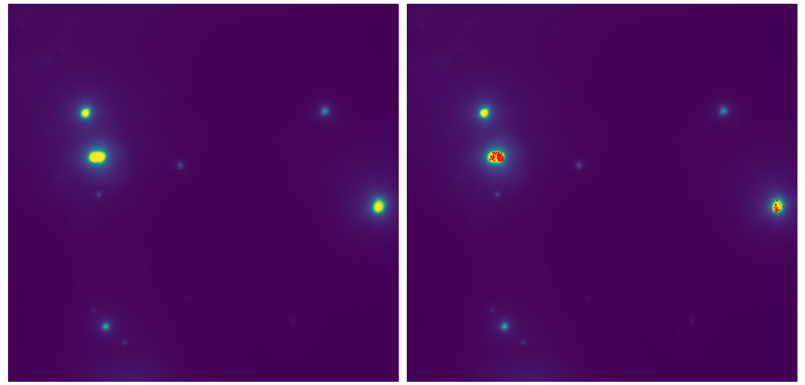

# Methods, plots and numerical results for Safieddine et al. (2023)

<!--  -->

This repository gathers the code used for the following paper:

__Title:__ Purifying p-bodies across the cell cycle reveals a widespread cyclic RNA storage function and an RNA localization mechanism dependent on the CDS length

__Authors:__ [Adham Safieddine](mailto:adham.safieddine@sorbonne-universite.fr)\*, Marie-Noëlle Benassy, Thomas Bonte, Michel Kress, Michèle Ernoult-Lange, Maïté Courel, Emeline Coleno, Antoine Laine, Annie Munier Godebert, Angelique Vinit, Corinne Blugeon, Guillaume Chevreux, Oriane Pourcelot ?, Edouard Bertrand, Daniel Gautheret, Thomas Walter, Marianne Bénard, [Dominique Weil](mailto:dominique.weil@upmc.fr)\*

<!-- [Adham Safieddine](mailto:safieddine.adham@gmail.com)1,2,\*, Emeline Coleno1,2, Soha Salloum1,2,3,+, Arthur Imbert4,5,6,+, Abdel-Meneem Traboulsi1,2, Oh Sung Kwon7, Frederic Lionneton8, Virginie Georget8, Marie-Cécile Robert1,2, Thierry Gostan1, Charles Lecellier1,2, Racha Chouaib1,2,5, Xavier Pichon1,2, Hervé Le Hir3 , Kazem Zibara5, Florian Müller9,10, Thomas Walter4,5,6, Marion Peter1,2, [Edouard Bertrand](mailto:edouard.bertrand@igmm.cnrs.fr)1,2,11,\*

>1Institut de Génétique Moléculaire de Montpellier, University of Montpellier, CNRS, Montpellier, France
2Equipe labélisée Ligue Nationale Contre le Cancer, University of Montpellier, CNRS, Montpellier, France
3ER045, PRASE, DSST, Faculty of Sciences-I, Lebanese University, Beirut, Lebanon
4MINES ParisTech, PSL-Research University, CBIO-Centre for Computational Biology, 77300 Fontainebleau, France
5Institut Curie, 75248 Paris Cedex, France
6INSERM, U900, 75248 Paris Cedex, France
7Institut de biologie de l'Ecole normale supérieure (IBENS), Ecole normale supérieure, CNRS, INSERM, PSL Research University, 46 rue d'Ulm, 75005, Paris, France
8BioCampus Montpellier, CNRS UMS3426, 141, rue de la Cardonille, 34094 Montpellier Cedex 5, France
9Unité Imagerie et Modélisation, Institut Pasteur and CNRS UMR 3691, 28 rue du Docteur Roux, 75015 Paris; France
10C3BI, USR 3756 IP CNRS – Paris, France
11Institut de Génétique Humaine, University of Montpellier, CNRS, Montpellier, France
>
>+Equal contributions-->

\*To whom correspondence should be addressed.

## Prerequisites

To run this notebook, we advise you to create your own dedicated environment. If you are using a GPU, make sure its drivers and the cuda libraries are correctly installed.

- Install [Anaconda](https://www.anaconda.com/products/distribution) for Python.
- Open an Anaconda prompt, and create a new empty environment with Python 3.9: `conda create --name p_bodies_cycle_2023 python=3.9`.
- Activate this environment using `conda activate p_bodies_cycle_2023`.
- Install [Cellpose](http://www.cellpose.org/), a Deep Learning based approach for nuclei and cells segmentation: `python -m pip install cellpose`.
- Install notebook requirements, including [BigFISH](https://github.com/fish-quant/big-fish), a python library to process smFISH images: `pip install -r requirements_notebook.txt`.

## Pipeline

Below, we provide a quick overview of the different steps in the analysis.

1. **Nucleus and cell segmentation using Cellpose & Bigfish** 
2. **Total RNA detection**
3. **P-body RNA detection**
4. **Results summary**

If you have any question relative to the image analysis, please contact [Thomas Bonte](mailto:thomas.bonte@mines-paristech.fr) or [Adham Safieddine](mailto:adham.safieddine@sorbonne-universite.fr) (or open an issue).

### Data

Current notebook is taking a .TIF image into input. Such image should contain (at least) 3 channels: DAPI, smFISH and GFP.

| DAPI | FISH | GFP |
| ------------- | ------------- | ------------- |
|  |  |   |

### 1 - Nucleus and cell segmentation using Cellpose & Bigfish

Using Cellpose for nucleus segmentation and Bigfish for cell segmentation, one can obtain such result.

### 2 - Total RNA detection

For each cell, RNA spots are then detected using Bigfish. Here are displayed two cells, one with high expression in the cytoplasm and low amounts of RNA in P-bodies, and another cell with high amounts of RNA in P-bodies.

### 3 - P-body RNA detection

For each cell, P-bodies are segmented with Bigfish to count the number of RNA molecules recruited. Here are displayed the same cells as in previous step.

### 4 - Results summary

Finally, all results can be saved in a csv file.

| cell_id|cell_area|nuc_area|nb_rna|nb_rna_in_nuc|nb_rna_out_nuc|nb_rna_recruited | 
|---|---|---|---|---|---|--- | 
| 1|47542|20564|114|28|86|0 | 
| 2|71320|33040|142|44|98|5 | 
| 3|19278|6481|61|6|55|1 | 
| 4|59265|27553|126|21|105|60 | 
| 5|34352|17316|73|12|61|4 | 
| 6|48689|12119|88|1|87|17 | 
| 7|54479|27799|37|13|24|9 | 
| 8|68061|26909|44|19|25|5 | 
| 9|33651|16329|125|78|47|0 | 
| 10|22641|9764|90|31|59|14 | 
| 11|50673|26573|39|13|26|1 | 
| 12|52307|27189|61|26|35|4 | 
| 13|63447|21221|113|14|99|60 | 
| 14|43046|24145|27|17|10|2 | 
| 15|56381|25698|155|15|140|100 | 
| 16|20682|10938|13|4|9|0 | 
| 17|96309|32900|412|84|328|39 | 
| 18|22838|12080|16|5|11|5 | 

## Licensing

- All code provided in this repository (notebook) is BSD-licenced (3 clause):
>Copyright © 2023, Thomas Bonte and Arthur Imbert  
>All rights reserved.
>
>Redistribution and use in source and binary forms, with or without
>modification, are permitted provided that the following conditions are met:
>    * Redistributions of source code must retain the above copyright
      notice, this list of conditions and the following disclaimer.
>    * Redistributions in binary form must reproduce the above copyright
      notice, this list of conditions and the following disclaimer in the
      documentation and/or other materials provided with the distribution.
>    * Neither the name of the copyright holder nor the names of its
      contributors may be used to endorse or promote products derived from
      this software without specific prior written permission.
>
>THIS SOFTWARE IS PROVIDED BY THE COPYRIGHT HOLDERS AND CONTRIBUTORS "AS IS" AND
ANY EXPRESS OR IMPLIED WARRANTIES, INCLUDING, BUT NOT LIMITED TO, THE IMPLIED
WARRANTIES OF MERCHANTABILITY AND FITNESS FOR A PARTICULAR PURPOSE ARE
DISCLAIMED. IN NO EVENT SHALL COPYRIGHT OWNER OR CONTRIBUTORS BE LIABLE FOR ANY
DIRECT, INDIRECT, INCIDENTAL, SPECIAL, EXEMPLARY, OR CONSEQUENTIAL DAMAGES
(INCLUDING, BUT NOT LIMITED TO, PROCUREMENT OF SUBSTITUTE GOODS OR SERVICES;
LOSS OF USE, DATA, OR PROFITS; OR BUSINESS INTERRUPTION) HOWEVER CAUSED AND
ON ANY THEORY OF LIABILITY, WHETHER IN CONTRACT, STRICT LIABILITY, OR TORT
(INCLUDING NEGLIGENCE OR OTHERWISE) ARISING IN ANY WAY OUT OF THE USE OF THIS
SOFTWARE, EVEN IF ADVISED OF THE POSSIBILITY OF SUCH DAMAGE.